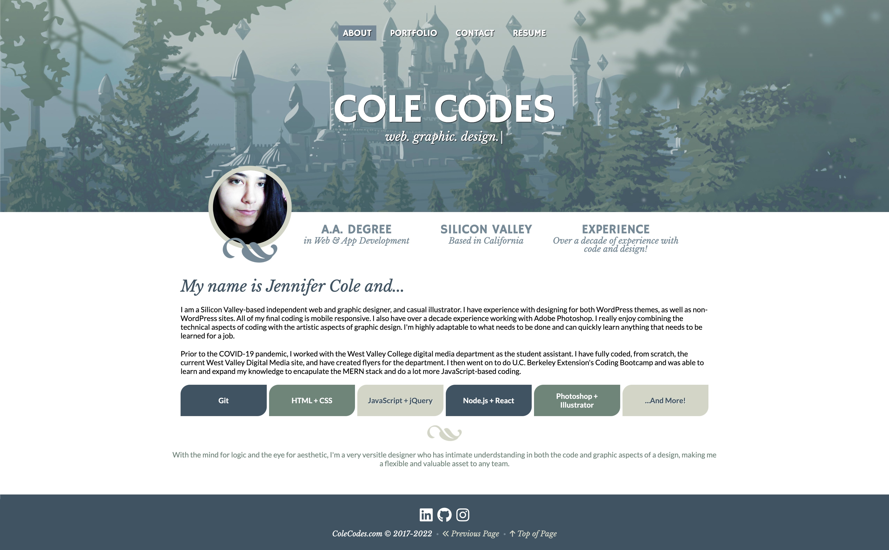

# React Portfolio

Tasked with creating a portfolio using React, this page was designed around a vector piece I did of a fantasy castle and features six different projects that showcase different skills.  
As a single-page application made with React, I used react-router-dom for page routes to give it a multi-page feel, and I used react-transition-group to apply transitions between the different "pages" of the application. I then used gh-pages to deploy the site to GitHub.  
The site title "Cole Codes" refers to my current portfolio website, [ColeCodes.com](https://colecodes.com), on which I plan to implement a Wordpress theme version of this portfolio design in the future.

## Table of Contents
* [Live Deployment](#live-deployment)
* [Screenshot](#screenshot)
* [Questions](#questions)

## Live Deployment
[View the live React Portfolio page on GitHub.](https://jcolecodes.github.io/react-portfolio/)

## Screenshot

## Questions
React Portfolio was created by [JColeCodes](https://github.com/JColeCodes). For inquiries regarding the project, please email the creator at [capauldi@gmail.com](mailto:capauldi@gmail.com).